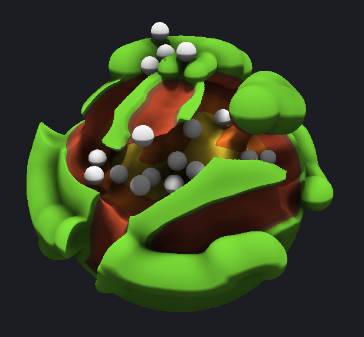

# Signed Distance Fields in Unity

[[Download the build on Itch.io]](https://sambigos.itch.io/signed-distance-fields-in-unity)

This is the result of playing around with using signed distance fields to render, deform, and do collision on geometry.

There are no polygons, no rigid bodies, and no standard physiscs engine running. All processing is done on the GPU.

Includes a debug menu to tweak parameters and explore features.
